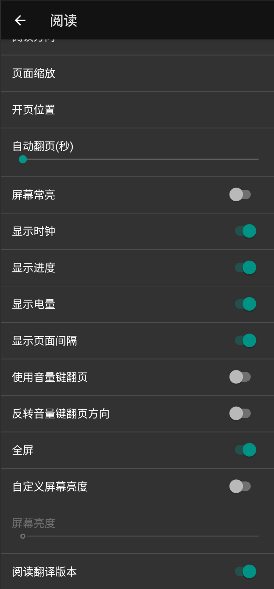
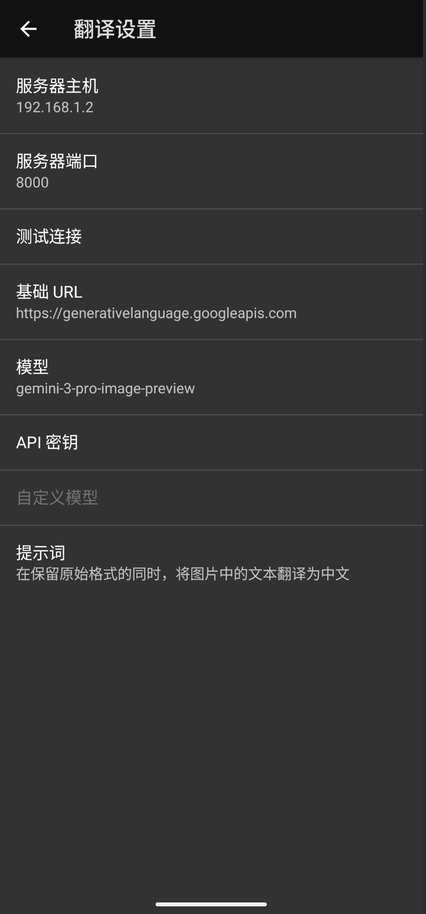
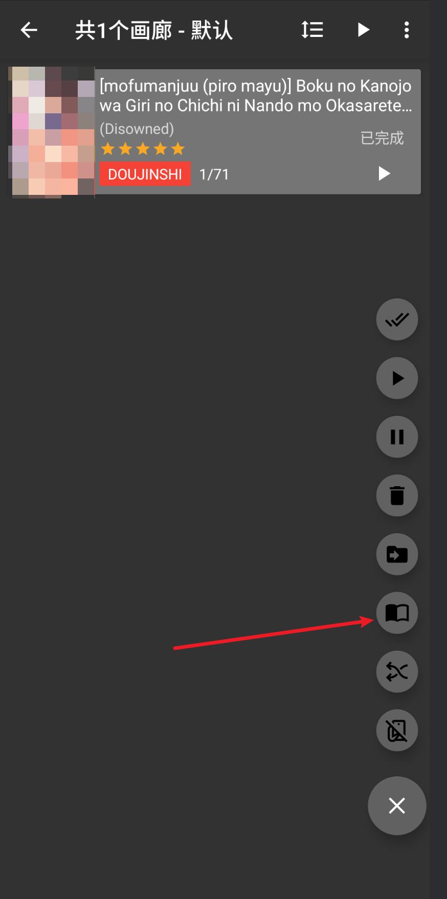
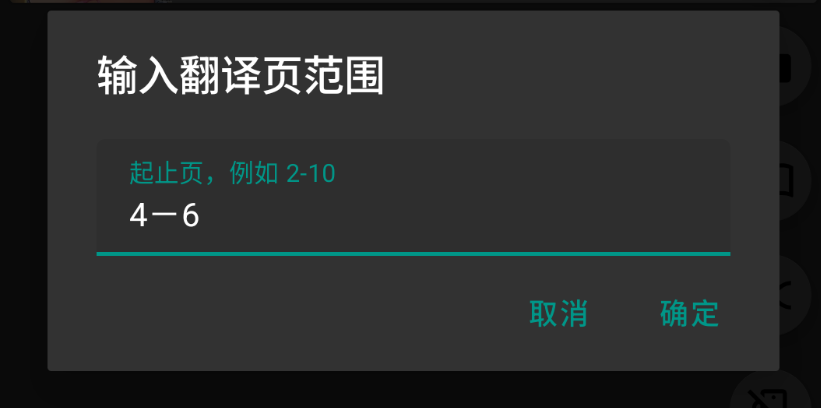
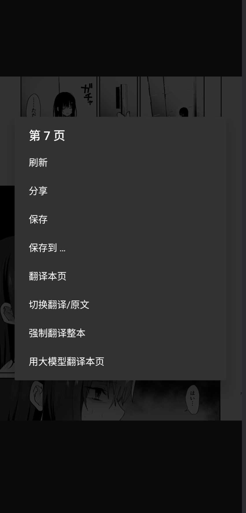
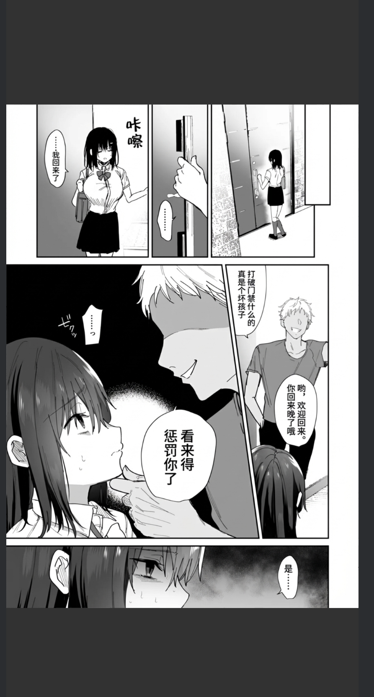

# EhViewer 自动翻译（自用）

本仓库仅用于为 EhViewer 增加“图片内文本翻译”能力，聚焦翻译相关逻辑与使用说明。内容仅供个人自用与研究，不提供技术支持，接口与行为可能随时变更。

Fork 来源：基于 `Ehviewer_CN_SXJ` 仓库二次开发并聚焦翻译功能，上游仓库 `https://github.com/xiaojieonly/Ehviewer_CN_SXJ`；原始项目 `EhViewer` 由 `seven332` 开发（`https://github.com/seven332/EhViewer`）。

## 功能概览
- 大模型单页翻译：在阅读页对当前图片进行遮罩与生成式翻译，生成译后图片并保存到 `translated` 子目录，页面会自动刷新显示。
- 普通批量翻译：将整本画廊打包为 zip 上传至本地服务，由服务端执行检测、OCR、擦写/重绘、翻译与导出，客户端轮询进度并下载结果。
- 使用定位：仅用于方便一键机翻，效果可能差强人意，适用于懒得手动修的，可在手机上直接翻译。
- 交互能力：支持在阅读页进行“译文/原文”切换，便于比对与回退。
- 支持范围翻译：可在普通批量翻译中选择翻译范围（例如2-5，代表第2页到第5页），默认全部。

## 演示

翻译配置（1–2）：在设置中填写普通服务主机/端口并测试连接；配置大模型的基地址、模型、通用提示词与 `API Key`。点击图片可查看原图。

<table>
  <tr>
    <td align="center" valign="top">
      
      
演示1：普通服务配置

    </td>
    <td align="center" valign="top">
      
      
演示2：大模型配置

    </td>
  </tr>
  <tr><td colspan="2" style="height:12px"></td></tr>
</table>

普通翻译流程（3–6）：在下载页选择“上传翻译”（支持范围选择），上传打包 zip；客户端轮询服务进度；结果下载到 `translated` 目录并自动刷新，阅读页可在“译文/原文”间切换。

<table>
  <tr>
    <td align="center" valign="top">
      
      
演示3：在下载列表选择需要翻译的作品

    </td>
    <td align="center" valign="top">
      
      
演示4：范围选择

    </td>
  </tr>
  <tr>
    <td align="center" valign="top">
      
      
演示5：翻译队列进度显示

    </td>
    <td align="center" valign="top">
      
      
演示6：译后展示

    </td>
  </tr>
</table>

大模型单页翻译（7–9）：在阅读页菜单选择“大模型翻译本页”（可先遮罩文本区域）；展示生成式翻译效果；对提示词增加“上色”等样式后展示改进示例。

<table>
  <tr>
    <td align="center" valign="top">
      
      
演示7：选择大模型翻译本页

    </td>
    <td align="center" valign="top">
      
      
演示8：大模型翻译效果

    </td>
    <td align="center" valign="top">
      
      
演示9：提示词上色后的效果

    </td>
  </tr>
</table>

## 自用声明

- 本项目仅满足作者个人使用场景，不保证稳定性与兼容性，不保证与上游仓库的同步更新。
- 不提供任何账号、密钥或云资源，也不保证第三方服务可用性。
- 使用造成的风险与后果由使用者自行承担，请勿用于任何违规用途。
 - 软件包分离与数据隔离：本软件与原始 EhViewer 的安装包分离，数据默认隔离。可使用“导出软件数据”功能进行同步与迁移（导出为数据库文件后在另一侧导入）。

## 大模型的局限与策略

- NSFW 限制：生成式模型可能拒绝或弱化成人内容，或输出不完整。策略为仅遮罩气泡/文本区域、弱化提示词、必要时降级为普通服务。
- 批量限制：成本与速率限制，以及额外的内容审查导致批量不太理想，仅在必要时使用大模型，故“不支持使用大模型进行批量翻译”。批量需求请使用下述普通服务方案。
- 质量与排版：生成图可能尺寸不一致或出现边缘瑕疵，客户端会缩放并做透明背景处理，但仍可能存在错位或风格不一致。
- API 依赖：需自备 `API Key`，模型与基地址可在应用设置内配置通用提示词与模型参数。

## 普通翻译需要自建服务

- 需要本地或内网运行一个 HTTP 服务（默认 `http://0.0.0.0:8000`）。
- 客户端调用的接口约定：
  - `GET /`：连通性测试。
  - `POST /translate`：表单上传 `zip`（整本）或 `file`（单张），返回 `{"job_id": "..."}`。
  - `GET /status?job_id=...`：查询任务进度与状态。
  - `GET /current_job`：获取当前任务信息。
  - `POST /cancel_current`：取消当前任务。
  - `GET /result?job_id=...`：下载翻译结果（打包输出）。
- 端口与主机在应用“设置-翻译设置”中配置：`translation_base_host/服务器主机`、`translation_base_port/服务器端口`。
- 输出格式建议 `webp`, 保持与输入相同的尺寸与质量。

- 快速部署示例（基于 BallonsTranslator）：
  - 仓库地址：`https://github.com/dmMaze/BallonsTranslator`（部署与依赖说明见其 README）。
  - 环境要求：`Python <= 3.12`，建议安装 Git；确保可以访问所需模型文件。
  - 获取源码或按其说明下载打包版；随后将提供的 API 服务解压到项目根目录下即可。
  - 启动服务：`python -m uvicorn server.api:app --host 0.0.0.0 --port 8000`
  - 在应用中配置“设置-翻译设置”：填入服务主机与端口，使用“测试连接”确认可用后即可开始上传 zip/单页进行翻译。
  - 使用的远端的配置，客户端不支持配置修改，若需修改请直接修改服务配置。

## 配置提示

- 大模型相关：可在设置中配置基地址、模型、通用提示词及 API Key。
- 普通服务相关：在设置中填入服务主机与端口后，可使用“测试连接”验证连通性。
- 模型支持范围：仅支持 Gemini API 的格式的模型。

## 目录与输出

- 译后图片保存在对应画廊下载目录的 `translated` 子目录下。

## 免责声明

- 以上功能与接口均可能调整，不保证长期兼容与可用。
- 本项目不承诺问题修复或用户支持，请谨慎评估并自行建设所需基础设施。
